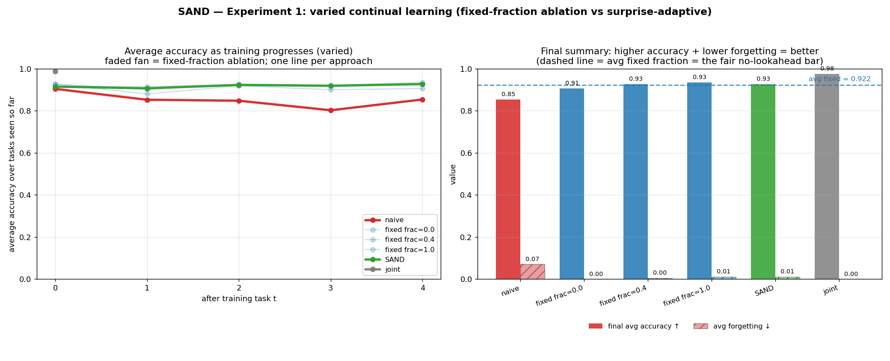
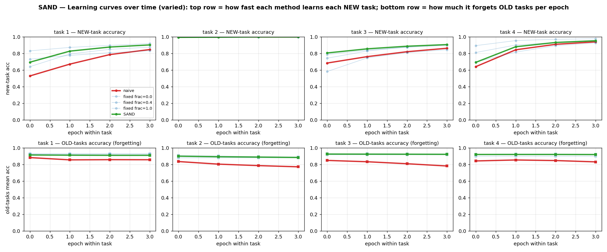
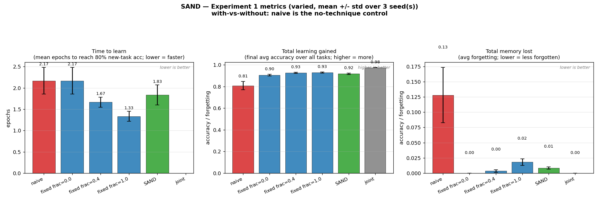

# SAND — Surprise-Adaptive Neural Directions

**Frozen directions, living gains — thawed by gradient conflict.**
Continual learning without catastrophic forgetting, using a plain MLP.

## What this is

A continual-learning method built on top of *magnitude–direction decoupling*
(the optimizer tool from arXiv:2606.25971). The paper introduced that tool for
*optimization stability*; SAND uses it to *prevent catastrophic forgetting* and
to *adapt the protection level to each new task automatically*.

## The core idea (plain language)

Every weight matrix carries two things:

- a **direction** — *what* a feature detects (the fragile, shared part that
  causes forgetting when it moves), and
- a **magnitude / gains** — *how loud* the feature is (a cheap per-task volume
  knob that barely causes forgetting).

We split each weight into `gains × direction (on a sphere) × gains` so we can
control them separately. The **direction is protected** (so old tasks survive);
per-task **gains** are the only thing that trains freely (a tiny per-task
adapter). The question SAND answers: *how much should the direction be allowed
to drift for a new task?*

## How SAND sets the drift (the part that works)

Per new task, SAND measures **gradient conflict** between the new task and a
tiny replay memory of old tasks (A-GEM / GPM / PCGrad style):

- Compute the direction gradient on the new task and on the old-task memory.
- Take their **cosine similarity** per layer.
- **Aligned** (cos ≈ +1) → drifting helps old tasks too → drift freely.
- **Orthogonal** (cos ≈ 0) → drifting doesn't touch old tasks → drift freely.
- **Opposite** (cos ≈ −1) → drifting would break old tasks → protect (little drift).

This measures the actual stability–plasticity trade-off per task, which is what
"surprise" was always trying to capture. A `safety = (cos+1)/2` factor sets a
per-layer direction learning rate. The probe is a few backward passes with no
kept optimizer steps, so the direction trains for the full budget (**equal
compute** to the baselines).

### What did NOT work (honest, for the writeup)

Three *need-based* probes were tried and fail to read task novelty:
gains-only **accuracy** (miscalibrated — gains fitting okay ≠ drift won't
help), raw **gradient magnitude** (confounded by loss scale), and one-step
**loss-drop** (dominated by step size). Only a *conflict-based* probe
(gradient cosine similarity against an old-task reference) works — matching
the continual-learning literature (A-GEM, GPM, NTK-overlap theory).

## Experiment 1 — what we're testing and how it's built

**The question:** is SAND (which picks the direction's drift *per task*) better
than just picking one fixed drift amount and using it for every task?

**The scenario:** a plain MLP learns **5 tasks in a row** on MNIST digit
subsets. After all 5, we measure (a) accuracy on every task and (b) how much
the earlier tasks were forgotten.

**The data — each task is a small digit-classification problem:**

```
task 0: {0,1,2,3,4}  -> 5-way  (builds a broad backbone)
task 1: {5,6}        -> 2-way  NOVEL   (digits never seen -> needs drift)
task 2: {0,1}        -> 2-way  FAMILIAR (already in backbone -> barely drifts)
task 3: {7,8}        -> 2-way  NOVEL
task 4: {3,4}        -> 2-way  FAMILIAR
```

The **alternation of novel and familiar tasks** is the key — it makes the
*right* amount of drift genuinely vary per task. A fixed method picks one
number and is stuck with it; SAND measures the variation and adapts. (On a
stream where every task is equally novel, a fixed number is just as good, so
this `varied` stream is where adaptivity can actually win.)

**How training works (per seed):**
1. **Task 0:** train direction + gains normally (build the backbone).
2. **Tasks 1–4:** for each new task, the method decides the direction's
   learning rate:
   - *naive* — train everything, forget freely (disaster baseline).
   - *fixed frac=X* — one constant direction LR for every task (no adaptivity).
   - *SAND* — run the cosine-conflict probe (new task vs. a tiny memory of old
     tasks) → set a per-task, per-layer direction LR → train.
3. After each task, evaluate on all tasks seen so far → accuracy + forgetting.

**Fairness:** every method gets the same compute (SAND's probe is a few
backward passes with no kept optimizer steps). The fair bar is the *average*
of the fixed fractions (a blindly-picked constant); the *best* fixed fraction
is reported as a hindsight-tuned ceiling, not the bar. We run **3 seeds** and
report mean ± std so the result isn't a fluke.

**`joint`** trains once on all 5 tasks' data mixed together — the ceiling
("if you'd had everything at once"), not a competitor.

## Result (Experiment 1, varied-MNIST, 3 seeds, fair compute)

### 1. Summary — average accuracy over tasks + final accuracy/forgetting



*Left* — one line per approach = average accuracy over all tasks seen so far,
vs the number of tasks trained (a method that forgets drops as tasks
accumulate; SAND/joint stay high). *Right* — final average accuracy (↑ better)
and average forgetting (↓ better) per condition; the dashed line is `avg fixed`
= the fair no-lookahead bar.

### 2. Learning curves over time — how fast it learns vs forgets, per epoch



Per-epoch accuracy as each task is trained. *Top row* = how fast each method
learns the NEW task (curves rising = learning). *Bottom row* = how much it
forgets the OLD tasks (curves dropping = forgetting). `naive` (no technique)
is the control on the same axes — it learns fast but the bottom row craters
(forgetting); SAND learns fast and the bottom row stays flat (no forgetting).

### 3. Metrics — time to learn, total learning, total memory lost



Three dedicated bar charts (mean ± std over seeds), each with the no-technique
control (`naive`) on the same axes: *time to learn* (epochs to 80% new-task
accuracy; lower = faster), *total learning gained* (final avg accuracy;
higher = more), *total memory lost* (avg forgetting; lower = better).

---

SAND reliably beats a blindly-picked fixed direction-LR (the fair bar) and
matches well-tuned fixed fractions — **without needing per-dataset
hyperparameter tuning**, and with the lowest variance of any method. It does
NOT clearly beat the best hindsight-tuned fixed fraction (expected — that
baseline is tuned with full knowledge of all tasks).

## Run it

```bash
# the full winning experiment — no flags needed:
python3 -u run_experiment_1.py
```

That runs varied-MNIST, shared head, hidden 32, 5 tasks, 4 epochs, 3 seeds,
fixed fractions {0, 0.4, 1.0}, + naive + SAND + joint, and writes `exp1.log`
plus three plots: `result-exp-1.png` (summary), `result-exp-1-curves.png`
(per-epoch learning curves), `result-exp-1-metrics.png` (time-to-learn /
total-learning / total-memory-lost bars).

Conditions: `naive` (forgetting baseline) · `fixed frac=…` (ablation) ·
`SAND` (ours) · `joint` (ceiling).

### Key knobs
- `--seeds 0` — single quick run instead of 3-seed.
- `--fracs 0,0.1,...,1.0` — the full 11-point fan for a paper figure.
- `--stream split` / `--permuted` — uniform-novelty streams (where a fixed
  fraction is just as good — useful for the "adaptivity needs varied drift-need"
  comparison).
- `--mem_size 256` — examples stored per past task for the cosine probe.
- `--max_frac` — direction LR when a task is fully safe to drift.
- `--surprise_temp` — shapes the cosine→safety mapping.

## Files
- `md_linear.py` — `MDLinear` (direction on a sphere + per-row/col gains) and
  the `MDMLP` container, with freeze / new-task / set-task controls and the
  per-layer direction-gradient helper the cosine probe uses.
- `run_experiment_1.py` — Experiment 1: the SAND method, fixed-fraction
  ablation, baselines, task streams, multi-seed aggregation, and the plot.
